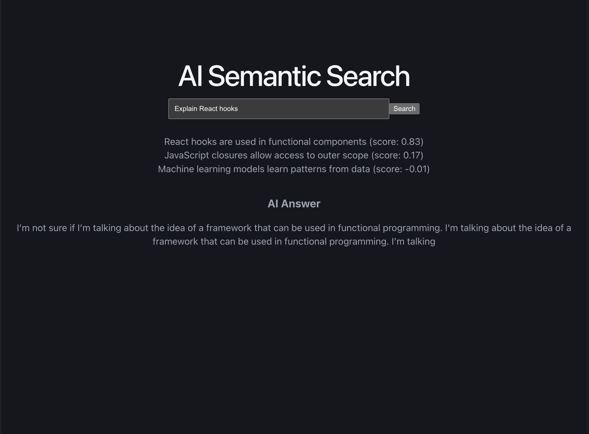

# AI Semantic Search using Endee Vector Database

## Project Overview

This project implements an **AI-powered semantic search system** that allows users to retrieve relevant information based on the meaning of a query rather than simple keyword matching.

The system converts both stored text and user queries into **vector embeddings**, and then performs **similarity search** to return the most relevant results.

The project demonstrates how **vector databases and embedding models** can be used to build real-world AI search applications.

---

## Tech Stack

### Frontend

* React
* Vite

### Backend

* Node.js
* Express

### AI / Machine Learning

* Transformers Embedding Model
* Cosine Similarity for vector search

### Vector Database

* Endee Vector Database (GitHub Repository)

---

## How Endee Vector Database is Used

Endee is used as the **vector database to store and retrieve text embeddings**.

When a user enters a query:

1. The query is converted into a **vector embedding** using a transformer embedding model.
2. Stored notes are also represented as **vector embeddings**.
3. The system performs **cosine similarity search using Endee**.
4. The most relevant results are retrieved based on **semantic similarity instead of keyword matching**.

This allows the application to understand the **meaning of the query** and return the most relevant information.

---

## System Architecture

User Query  
↓  
React Frontend  
↓  
Node.js API  
↓  
Embedding Model (Text → Vector)  
↓  
Endee Vector Database  
↓  
Vector Similarity Search  
↓  
Relevant Result  

---

## Features

* AI-powered semantic search
* Embedding-based similarity matching
* Full-stack application (React + Node.js)
* Fast vector search using cosine similarity
* Clean and simple UI for testing queries
* Integration with Endee vector database

---

## Project Structure

```
endee
│
├── backend
│   ├── db.js
│   ├── generate.js
│   ├── search.js
│   ├── server.js
│   ├── test.js
│   └── vector.js
│
├── frontend-app
│   ├── src
│   ├── public
│   └── package.json
│
├── assets
│   └── demo.png
│
├── README.md
├── package.json
└── [Endee core C++ source files and docs]
```

---

## Note Regarding Deployment

While the frontend interface is deployed on Vercel (`https://endee-study-frontend.vercel.app/`), **the project requires the actual Endee Vector Database (a C++ engine) and the Node.js backend to run locally on your machine.**

If you visit the live URL without running the database and backend locally, the Search and Add actions will fail (Connection Refused). To test the project properly, please follow the **Local Setup instructions** below.

---

## Installation & Setup

### 1. Clone the repository

```bash
git clone https://github.com/gitxpriyanshu/endee.git
```

---

### 2. Start the Endee Vector Database

Because this app is built on top of the real Endee engine, you must run it locally first:

```bash
chmod +x ./run.sh
./run.sh
```

The database will run on `http://localhost:8080`.

---

### 3. Install backend dependencies

```bash
cd backend
npm install
```

Run backend server:

```bash
node server.js
```

Backend will start at `http://localhost:3001`

---

### 3. Install frontend dependencies

```bash
cd frontend-app
npm install
npm run dev
```

Frontend will start at:

```
http://localhost:5173
```

---

## API Endpoints

### Add Note

```
POST /add-note
```

Example request:

```json
{
"text": "React hooks are used in functional components"
}
```

---

### Search Query

```
POST /search
```

Example request:

```json
{
"query": "Explain React hooks"
}
```

---

## Demo

Example Query:

```
Explain React hooks
```

Output:

```
React hooks are used in functional components (score: 0.83)
```

---

## Demo Screenshot



---

## Author

Priyanshu Verma  
B.Tech Computer Science  
Newton School of Technology
